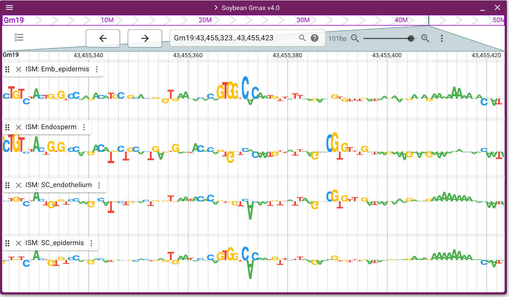

# jbrowse-plugin-attrmap

This is an external plugin for the [JBrowse 2](https://jbrowse.org/jb2/)
open-source platform for visualizing and integrating biological data.

This plugin implements an **Attribution Map (AttrMap)** visualization track for displaying
sequence-level attribution scores from models like scBasset or BPNet. It renders base-pair
resolution attribution data as sequence logos, where:
- ATCG letters replace traditional bar charts
- Letter height represents attribution score magnitude
- Positive scores extend upward from baseline
- Negative scores extend downward (inverted)
- Each base has fixed width for consistent visualization
- Letter colors: A=green, T=red, G=yellow, C=blue

This plugin builds on the concept of "quantitative sequence" tracks and combines quantitative
data with reference sequence information for regulatory genomics analysis.

## Example Visualization




## Install

### For use in [JBrowse Web](https://jbrowse.org/jb2/docs/quickstart_web)

Add the plugin to your JBrowse 2 installation by referencing the built plugin file.


## Usage

Add to the "plugins" of your JBrowse Web config:

```json
{
  "plugins": [
    {
      "name": "AttrMap",
      "url": "/path/to/jbrowse-plugin-attrmap.umd.production.min.js"
    }
  ]
}
```

Here is an example track configuration:

```json
{
  "type": "QuantitativeTrack",
  "trackId": "soybean_ism_attribution",
  "name": "Soybean ISM Attribution Scores",
  "assemblyNames": ["Gmax_508_v4.0"],
  "adapter": {
    "type": "QuantitativeSequenceAdapter",
    "wiggleAdapter": {
      "type": "BigWigAdapter",
      "bigWigLocation": {
        "uri": "/path/to/attribution_scores.bw"
      }
    },
    "sequenceAdapter": {
      "type": "IndexedFastaAdapter",
      "fastaLocation": {
        "uri": "/path/to/reference_genome.fa"
      },
      "faiLocation": {
        "uri": "/path/to/reference_genome.fa.fai"
      }
    }
  },
  "displays": [
    {
      "displayId": "QuantitativeSequence_display",
      "type": "QuantitativeSequenceDisplay"
    }
  ]
}
```

This specifies an adapter for where the reference sequence is derived from, in addition to
where the BigWig attribution data is derived from, and configures the display format as
sequence logos.

## Version

Current version: 0.1.0

## Citation
`On pending...`

## Credits

This plugin is based on the original [jbrowse-plugin-quantseq](https://github.com/GMOD/jbrowse-plugin-quantseq)
by Elliot Hershberg, adapted for attribution map visualization.

## License

MIT
